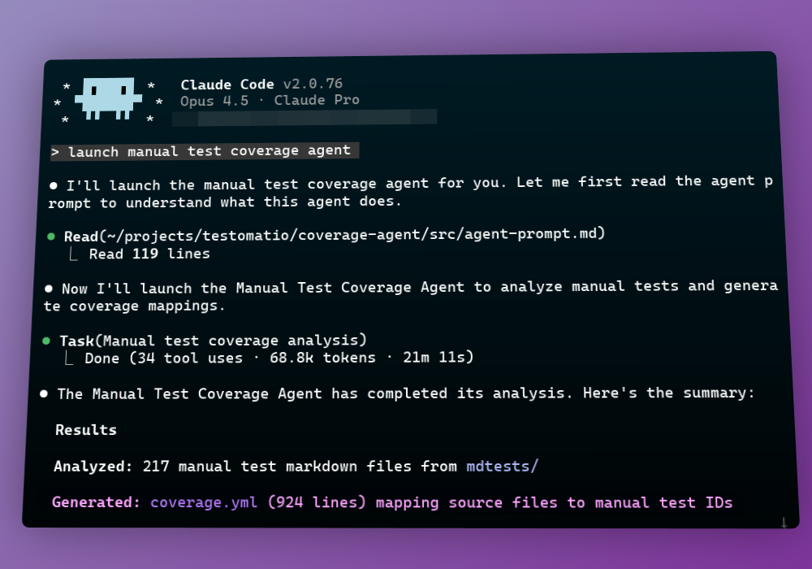

# Testomatio Coverage Agent



**Run only the tests that matter. Stop waiting for your entire test suite on every small change**

## The Problem

Developer adds a tiny one-line fix to a file in source code.
Now happens testing.

While unit tests are fast, end-to-end tests are slow.
This change can potentially lead to running all end2end and manual regression tests.

Understanding what was affected by change can dramatically reduce the number of tests to run.

## The Solution

**Coverage Agent** maps your source files to both e2e and manual tests. When Testomatio Reporter triggers, it shows **only the tests that matter** for your changes—e2e tests to run during CI, manual tests to execute during QA validation.

When running slow end-to-end tests (web or mobile) you can filter them by affected source files.

Same happens for manual tests. You can run regressions only **relevant** to your changes.

## How It Works

1. **Coverage Agent** analyzes your manual/e2e tests and generates a `coverage.yml` file
2. **Testomatio Reporter** reads the coverage file, runs `git diff`, and executes only relevant tests
3. You save time and get faster feedback

## Installation

```bash
npx @testomatio/coverage-agent manual
# or
npx @testomatio/coverage-agent automated
```

## Usage

### Manual Tests Coverage

Prerequisites:
- Current workdir is the source code of your application
- [Claude Code](https://claude.ai/code) or any other coding agent
- Existing project with manual tests in [Testomat.io TMS](https://app.testomat.io)

Analyzes manual test cases from Testomat.io and maps them to your source code.

```bash
npx @testomatio/coverage-agent manual
```

This will:
- Pull manual tests from Testomat.io into `mdtests/` directory
- Generate a prompt for Claude Code to analyze tests and code
- Output `coverage.manual.yml` after Claude completes

**Options:**
```
--mdtests-dir <dir>   Directory for markdown tests (default: mdtests)
--output <file>       Output coverage file (default: coverage.manual.yml)
--skip-pull           Skip pulling tests from Testomatio
```

Then you need manually run Claude code with the prompt that CLI provides to you

The command will look like this:

```
claude "launch manual e2e test coverage agent" \
  --append-system-prompt <path-to-generated-prompt>
```
Claude code will analyze prompt, read markdown files, read source code and create mapping in `coverage.manual.yml`. You are free to control and guide it through process, asking to look at specific parts of the code or tests. Only permissions to save final file `coverage.manual.yml` is required for the workdir.

Now you can create a manual run in Testomat.io using CLI.
It is important to specify the stable branch we compare changes to in order to get a complete list of affected tests. If our stable branch is `main`, we can run:

```
npx @testomatio/reporter run --kind manual --filter "coverage:file=coverage.manual.yml,diff=main"
```

Let's break down this command:

* `npx @testomatio/reporter run` - run Testomat.io Reporter CLI 
* `--kind manual` to create a manual run in Testomat.io
* `--filter "coverage:file=coverage.manual.yml,diff=main"` parameters for coverage processing:
  - `coverage:file=coverage.manual.yml` - specify the coverage file to process
  - `diff=main` - specify the stable branch to compare changes to

This will create a new pending manual run and provide you a link

It is recommended to store auto-created manual runs in their own group by setting `TESTOMATIO_RUNGROUP` environment variable, so you could merge them later when you start regression testing.

```
TESTOMATIO_RUNGROUP="Regression 911" npx @testomatio/reporter run --kind manual --filter "coverage:file=coverage.manual.yml,diff=main"
```

### E2E Tests Coverage

Prerequisites:
- [Claude Code](https://claude.ai/code) or any other coding agent
- Existing project with e2e tests in [Testomat.io TMS](https://app.testomat.io)
- Git repository with e2e tests and Testomat.io IDs placed in code (via `check-tests --update-ids`)

Analyzes automated e2e tests (Playwright, Cypress, WebDriver, etc.) and maps them to your source code.

```bash
npx @testomatio/coverage-agent automated
```

This will:
- Create a temporary directory for tests (or use `--tests-dir`)
- Generate a prompt for Claude Code to analyze tests and code
- Output `coverage.e2e.yml` after Claude completes

**Options:**
```
--tests-dir <dir>     Directory with e2e tests (creates temp dir if not provided)
--output <file>       Output coverage file (default: coverage.e2e.yml)
```

Then you need manually run Claude code with the prompt that CLI provides to you

The command will look like this:

```
claude "launch automated e2e test coverage agent" \
  --append-system-prompt <path-to-generated-prompt>
```
Claude code will analyze prompt, read the test files, read source code and create mapping in `coverage.e2e.yml`. You are free to control and guide it through process, asking to look at specific parts of the code or tests. Only permissions to save final file `coverage.e2e.yml` is required for the workdir.

Now you can create an automated run in Testomat.io using CLI.
It is important to specify the stable branch we compare changes to in order to get a complete list of affected tests. If our stable branch is `main`, we can run:

```
npx @testomatio/reporter run "npx playwright test" --filter "coverage:file=coverage.e2e.yml,diff=main"
```

This creates a subset of tests based on filters and launches the test runner (playwright in this case).

It is important to pass in actual run command like `npx playwright test` or `npx mocha`, as `--filter` will generate `--grep` parameters, that must be passed to test runner. `--grep` will consist of Testomat.io IDs of affected tests and suites, so source code must contain them.

Let's break down this command:

* `npx @testomatio/reporter run` - run Testomat.io Reporter CLI 
* `npx playwright test` - actual run command (can be jest, webdriverio, etc)
* `--filter "coverage:file=coverage.e2e.yml,diff=main"` parameters for coverage processing:
  - `coverage:file=coverage.e2e.yml` - specify the coverage file to process
  - `diff=main` - specify the stable branch to compare changes to


### GitHub Actions Integration

Ensure that coverage files are created and **committed** to the repository before running tests.

Now we can add a pipeline to run tests based on code changes:

```yaml
name: Run Tests Based on Changes

on:
  pull_request:
    branches: [main]

jobs:
  e2e-tests:
    runs-on: ubuntu-latest
    steps:
      - uses: actions/checkout@v4
        with:
          fetch-depth: 0
      
      # here you should install browsers
      # and prepare application for testing
      
      - name: Run affected E2E tests
        env:
          TESTOMATIO: ${{ secrets.TESTOMATIO }}
        run: |
          npx @testomatio/reporter run "npx playwright test"            
            --kind automated \
            --filter "coverage:file=coverage.e2e.yml,diff=origin/main"

  manual-tests:
    runs-on: ubuntu-latest
    steps:
      - uses: actions/checkout@v4
        with:
          fetch-depth: 0
      
      - name: Create manual test run for affected tests
        env:
          TESTOMATIO: ${{ secrets.TESTOMATIO }}
        run: |
          npx @testomatio/reporter run \
            --kind manual \
            --filter "coverage:file=coverage.manual.yml,diff=origin/main"
```


> [!NOTE]
> E2E and manual tests may be in separate Testomat.io projects. Each project has its own API key (`${{ secrets.TESTOMATIO }}` in examples). Use different secret names like `TESTOMATIO_E2E_KEY` and `TESTOMATIO_MANUAL_KEY` if you have separate projects.

## License

MIT
